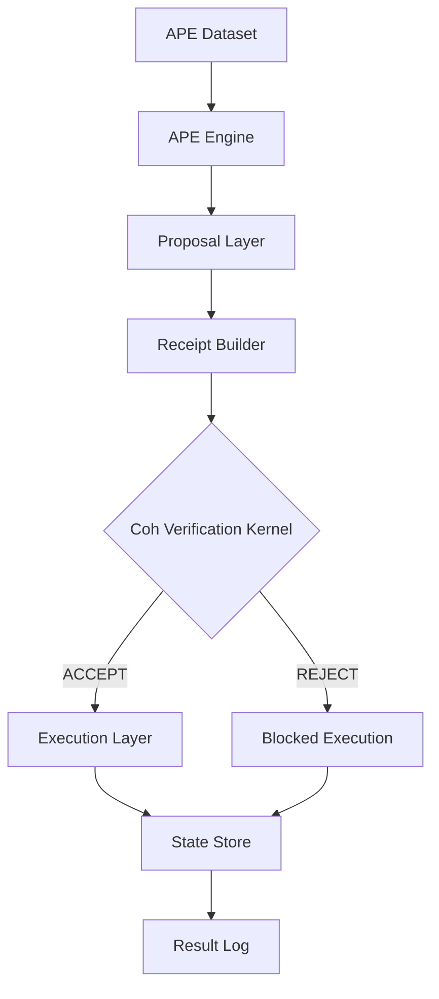

# APE + COH System Architecture

> Complete workflow slice showing how APE generates proposals and Coh validates them

---

## High-Level Flow



---

## Component Mapping

### 1. APE Dataset → Action Generation

| Dataset Type | Location | Description |
|-------------|----------|-------------|
| Valid workflows | `coh-node/vectors/valid/` | Correct multi-step chains |
| Adversarial | `coh-node/vectors/adversarial/` | Attack strategies |
| Semi-realistic | `coh-node/vectors/semi_realistic/` | Real-world edge cases |

### 2. APE Engine → Proposal Generator

The APE (Adversarial Proposal Engine) generates candidate actions:

- **baseline_valid**: Correct, policy-compliant actions
- **policy_violation**: Spending beyond limits
- **spec_gaming**: Edge-case exploitation
- **temporal_drift**: Time-based manipulation
- **adversarial_alignment**: Goal misdirection

### 3. Proposal → Receipt Conversion

CLI command: `build-slab` (or individual receipt construction)

Input: Action proposal from APE
Output: MicroReceipt with:
```json
{
  "schema_id": "coh.receipt.micro.v1",
  "state_hash_prev": "...",
  "chain_digest_prev": "...",
  "metrics": { "v_pre": "100", "spend": "15" },
  "action": { ... }
}
```

### 4. Coh Verification Kernel

**Primary Entry Points:**

| Command | Purpose | Exit Code |
|---------|---------|-----------|
| `verify-micro` | Single receipt validation | 0=ACCEPT, 1=REJECT |
| `verify-chain` | Multi-step chain validation | 0=ACCEPT, 1=REJECT |
| `verify-slab` | Aggregated receipt validation | 0=ACCEPT, 1=REJECT |
| `build-slab` | Create macro receipt | 4=SOURCE_ERROR |

**Verification Steps:**

1. **Schema Check** → Validates `schema_id` and `version`
2. **State Hash Continuity** → `state_hash_prev` matches prior `state_hash_next`
3. **Chain Digest Continuity** → `chain_digest_prev` matches prior `chain_digest_next`
4. **Accounting Law** → `v_post + spend ≤ v_pre + defect + authority`
5. **Policy/Permissions** → Action allowed for this object
6. **Domain Constraints** → Parameters within valid ranges

### 5. Execution Layer (Post-Accept)

Only executes if Coh returns ACCEPT:

```rust
if verify_micro(receipt) == Decision::Accept {
    apply_action(state, action);
    persist_state(state);
    log_result(decision, trace);
} else {
    // Blocked - no state change
    log_rejection(decision, reason, trace);
}
```

---

## Decision Semantics

### ACCEPT = Valid State Transition Exists

```
State(t) → [ACCEPT] → State(t+1)
```

The receipt proves a mathematically valid state transition.

### REJECT = No Valid Transition Exists

```
State(t) → [REJECT] → State(t)  // unchanged
```

**Critical distinction:**
- REJECT ≠ failure
- REJECT = the proposed transition violates the contract
- State remains unchanged - this is the safety guarantee

---

## CLI Demo Commands

### Quick Demo (60 seconds)

```bash
# From repo root
demo.bat
```

### AI Workflow Demo

```bash
ai_demo.bat
```

### Manual Step-by-Step

```bash
# 1. Verify valid micro receipt
coh-node\target\debug\coh-validator.exe verify-micro coh-node\examples\micro_valid.json
# → ACCEPT (exit 0)

# 2. Verify tampered receipt
coh-node\target\debug\coh-validator.exe verify-micro coh-node\examples\micro_invalid_digest.json
# → REJECT (exit 1, reason: digest mismatch)

# 3. Verify valid chain
coh-node\target\debug\coh-validator.exe verify-chain coh-node\examples\chain_valid.jsonl
# → ACCEPT (exit 0)

# 4. Verify broken chain
coh-node\target\debug\coh-validator.exe verify-chain coh-node\examples\chain_invalid_state_link.jsonl
# → REJECT (exit 1, reason: state link broken at step N)

# 5. Build slab from valid chain
coh-node\target\debug\coh-validator.exe build-slab coh-node\examples\chain_valid.jsonl --out coh-node\examples\demo_slab.json

# 6. Verify slab
coh-node\target\debug\coh-validator.exe verify-slab coh-node\examples\demo_slab.json
# → ACCEPT (exit 0)
```

---

## Investor Pitch Line

> **"APE generates possible actions, and Coh ensures only valid transitions can exist in system state."**

### The Money Demo

```
Agent → proposes bad action
   ↓
Coh → REJECT (deterministic)
   ↓
State → unchanged
```

This single flow is the entire value proposition.

---

## Performance Metrics

| Metric | Value |
|--------|-------|
| Micro verify | 31μs |
| Chain verify (5-step) | 1.7ms |
| Throughput | 32K/sec |
| Adversarial rejection | 100% |
| p99 latency | 280μs |

See: [`coh-node/examples/bench_v1.json`](coh-node/examples/bench_v1.json), [`coh-node/examples/dominance_v1.json`](coh-node/examples/dominance_v1.json)

---

## File Structure Reference

```
coh-node/
├── examples/
│   ├── micro_valid.json          # Valid single receipt
│   ├── micro_invalid_*.json       # Invalid receipt variants
│   ├── chain_valid.jsonl         # Valid 5-step chain
│   ├── chain_invalid_*.jsonl     # Invalid chain variants
│   ├── ai_demo/                  # AI workflow examples
│   ├── bench_v1.json             # Performance benchmarks
│   └── dominance_v1.json         # Adversarial test results
├── target/debug/
│   └── coh-validator.exe         # CLI binary
└── crates/coh-core/src/
    ├── verify_micro.rs            # Core verification logic
    ├── verify_chain.rs           # Chain validation
    └── verify_slab.rs            # Slab validation
```

---

## See Also

- [LEAN_RUST_TRACEABILITY_MATRIX.md](../plans/LEAN_RUST_TRACEABILITY_MATRIX.md) - Formal proof mapping
- [ERROR_REJECT_CONTRACT.md](../plans/ERROR_REJECT_CONTRACT.md) - Reject code taxonomy
- [APE_INVESTOR_METRICS.md](../plans/APE_INVESTOR_METRICS.md) - Performance data
- [WEDGE_CHECKLIST.md](../coh-node/WEDGE_CHECKLIST.md) - Stability certification