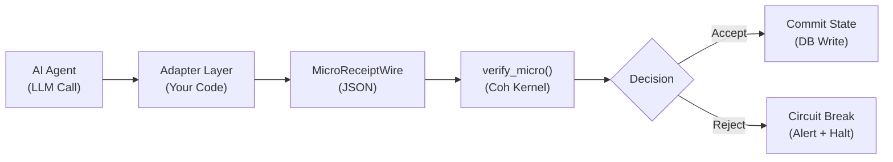

# Coh Validator — Integration Examples

This directory contains copy-paste ready templates for integrating Coh Validator into your AI agent infrastructure.

---

## Available Templates

| File | Description |
|---|---|
| [`generic_agent_loop.rs`](generic_agent_loop.rs) | Universal template for any agent loop (OpenAI, Anthropic, local models) |
| [`openai_function_calling.rs`](openai_function_calling.rs) | Example wrapping OpenAI function-calling with Coh safety gating |

---

## Quick Integration Guide

### 1. Add `coh-core` as a dependency

```toml
# Cargo.toml
[dependencies]
coh-core = { path = "../coh-node/crates/coh-core" }
```

### 2. Implement the Adapter Pattern

The key insight is to convert your LLM's output into a `MicroReceiptWire` before committing any state:

```rust
use coh_core::{verify_micro, Decision};
use coh_core::types::MicroReceiptWire;

// After your LLM returns a completion:
let receipt = adapter_llm_to_receipt(&llm_output, &current_state);

// Gate execution — never commit before this check:
let result = verify_micro(receipt);
match result.decision {
    Decision::Accept => { /* safe to commit */ }
    Decision::Reject => { /* halt — log result.message */ }
    _ => unreachable!(),
}
```

### 3. The Accounting Fields

Map your domain to Coh's accounting model:

| Coh Field | Your Domain Concept | Example |
|---|---|---|
| `v_pre` | State value before step | Account balance before transaction |
| `v_post` | State value after step | Account balance after transaction |
| `spend` | Consumed resources | Transaction amount, API cost, tokens used |
| `defect` | Allowed slack/variance | Rounding tolerance, approved overdraft |

**The invariant that must hold:**
```
v_post + spend ≤ v_pre + defect
```

If your agent tries to create value from nothing (e.g., reports a higher balance after spending), this inequality fails → `RejectPolicyViolation`.

---

## The Integration Loop



---

## Sealing Receipts

Every receipt must be sealed with a cryptographic digest that chains it to the previous step:

```rust
use coh_core::canon::{to_canonical_json_bytes, to_prehash_view};
use coh_core::hash::compute_chain_digest;
use coh_core::types::MicroReceipt;
use std::convert::TryFrom;

fn seal(receipt: &MicroReceiptWire) -> String {
    let runtime = MicroReceipt::try_from(receipt.clone()).unwrap();
    let prehash = to_prehash_view(&runtime);
    let bytes = to_canonical_json_bytes(&prehash).unwrap();
    compute_chain_digest(runtime.chain_digest_prev, &bytes).to_hex()
}

// Usage:
receipt.chain_digest_next = seal(&receipt);
```

---

## Running the Examples

These files are reference implementations. To run them as standalone examples, copy them into `coh-node/crates/coh-core/examples/` and add an entry to `Cargo.toml`:

```toml
[[example]]
name = "generic_agent_loop"
path = "examples/integrations/generic_agent_loop.rs"
```

Then run:

```bash
cargo run --example generic_agent_loop -p coh-core --release
```

---

## Need Help?

See the full documentation in:
- [`coh-node/crates/coh-core/README.md`](../crates/coh-core/README.md) — API reference
- [`coh-node/docs/CASE_STUDY.md`](../docs/CASE_STUDY.md) — real-world failure scenario
- [`FORMAL_FOUNDATION.md`](../../FORMAL_FOUNDATION.md) — mathematical foundation
