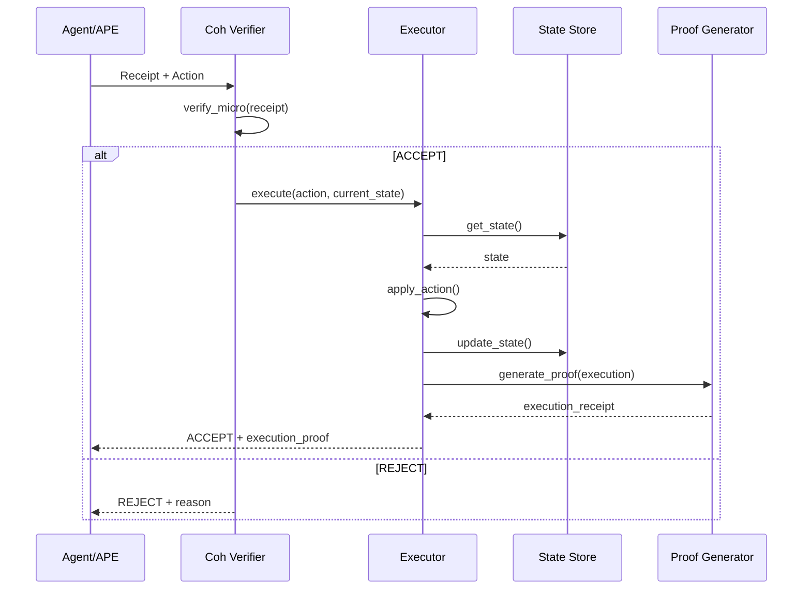

# Execution Layer Design

> Design for a state transition executor that proves correct execution

---

## Current Implementation

The current `execute_verified_handler` in [`coh-sidecar/src/routes.rs:85`](coh-node/crates/coh-sidecar/src/routes.rs#L85) provides:

```
Receipt + Action → Verify → If ACCEPT: return Action (for caller to execute)
                     → If REJECT: block execution, return error
```

**Limitation:** The caller must actually execute the action. Coh only provides the "approval" - not the proof of execution.

---

## Goal: Prove Execution

We need an execution layer that:

1. **Verifies** the receipt (existing)
2. **Executes** the action (new)
3. **Proves** the execution happened (new)
4. **Records** the proof (new)

```
┌─────────────────┐    ┌──────────────┐    ┌─────────────┐    ┌─────────────┐
│ Receipt + Action│ -> │   VERIFY    │ -> │  EXECUTE   │ -> │   PROVE    │
│                 │    │ (Coh Kernel)│    │ (Executor) │    │ (Receipt') │
└─────────────────┘    └──────────────┘    └─────────────┘    └─────────────┘
```

---

## Architecture Components

### 1. Execution Engine

```rust
trait Executor {
    fn execute(&self, action: &Action, state: &State) -> Result<State, ExecError>;
    fn rollback(&self, state: &State) -> Result<State, ExecError>;
}
```

**Implementations:**
- `DryRunExecutor` - No state change, just validation
- `RealExecutor` - Actual state mutation
- `SimulationExecutor` - What-if analysis

### 2. Proof Generator

```rust
trait ProofGenerator {
    fn generate(&self, execution: &Execution, receipt: &MicroReceipt) -> ExecutionProof;
}
```

**Output:** A new receipt proving the execution happened.

### 3. State Store

```rust
trait StateStore {
    fn get(&self, key: &str) -> Option<State>;
    fn set(&self, key: &str, state: State);
    fn history(&self, key: &str) -> Vec<State>;
}
```

---

## Execution Flow with Proof



---

## Proof Format

The execution generates a new receipt that proves the action was executed:

```json
{
  "schema_id": "coh.receipt.execution.v1",
  "version": "1.0.0",
  "parent_receipt_hash": "...",
  "action_result": {
    "status": "success",
    "state_prev": "...",
    "state_next": "..."
  },
  "execution_timestamp": 1700000000,
  "proof": "..."
}
```

---

## Integration with Existing Components

### Sidecar API Extension

```rust
// New endpoint
POST /v1/execute-proved

Request:
{
  "receipt": MicroReceiptWire,
  "action": Action,
  "execution_mode": "dry-run" | "real" | "simulation"
}

Response:
{
  "decision": "Accept" | "Reject",
  "execution_proof": Option<ExecutionProof>,
  "state_snapshot": State
}
```

### CLI Commands

```bash
# Dry-run (no state change, just proof)
coh-validator.exe execute --mode dry-run --action payment.json receipt.json

# Real execution (state changes)
coh-validator.exe execute --mode real --action payment.json receipt.json

# Simulation (what-if analysis)
coh-validator.exe execute --mode simulate --action payment.json receipt.json
```

---

## State Transition Proof Chain

```
Initial State: S0
    │
    ├─[Action A1]─[Verify]─[Accept]─[Execute]─> S1
    │                                            │
    ├─[Action A2]─[Verify]─[Reject]─X            │ (blocked)
    │                                            │
    └─[Action A3]─[Verify]─[Accept]─[Execute]─> S2
                                                  │
Proof Chain: [Receipt A1] → [Receipt A3] → [Receipt A3_exec]
```

---

## Execution Modes Comparison

| Mode | State Change | Proof Generated | Use Case |
|------|-------------|-----------------|----------|
| **dry-run** | ❌ No | ✅ Yes | Testing, CI/CD |
| **real** | ✅ Yes | ✅ Yes | Production |
| **simulation** | ❌ No | ⚠️ Conditional | What-if analysis |

---

## Investor Value Proposition

> "Not only do we verify before execution - we **prove** execution happened correctly."

This transforms Coh from:
- ❌ "validation layer" 
- ✅ "execution guarantee system"

The proof can be:
- Stored in state store for audit
- Used for compliance reporting
- Verified by third parties

---

## Implementation Phases

### Phase 1: Basic Execution (Current)
- [x] Verify receipt
- [x] Return action on ACCEPT
- [ ] Execute action (placeholder)

### Phase 2: State Management
- [ ] State store interface
- [ ] Basic key-value state
- [ ] State history tracking

### Phase 3: Proof Generation
- [ ] Execution receipt format
- [ ] Parent chain linkage
- [ ] Cryptographic proof

### Phase 4: Full Integration
- [ ] API endpoints
- [ ] CLI commands
- [ ] Dashboard visualization

---

## See Also

- [SYSTEM_ARCHITECTURE.md](SYSTEM_ARCHITECTURE.md) - Current system flow
- [APE_DATASET_SHOWCASE.md](APE_DATASET_SHOWCASE.md) - Dataset for APE
- [coh-sidecar/src/routes.rs:85](coh-node/crates/coh-sidecar/src/routes.rs#L85) - Current execute endpoint