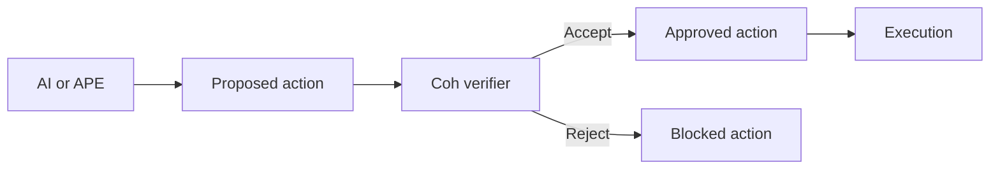

# APE End-to-End Demo and Benchmark Plan

## Objective

Build a real-data trust-kernel demo that proves the full flow:

`AI or APE -> proposed action -> verifier -> approved action -> execution`

while also adding reproducible benchmark paths for local CLI and sidecar HTTP execution.

## Existing Building Blocks

- APE CLI exists in `ape` and already supports generate and execute-verified flows.
- Coh verifier benchmark patterns already exist in [`benchmark_ai_demo.rs`](../coh-node/crates/coh-core/examples/benchmark_ai_demo.rs:13).
- Windows batch demos already exist in [`ai_demo.bat`](../ai_demo.bat) and [`demo_full.bat`](../demo_full.bat).
- Sidecar gated execution already exists at [`execute_verified_handler()`](../coh-node/crates/coh-sidecar/src/routes.rs:85).
- Dashboard demo artifacts already exist under [`coh-dashboard/public/demo`](../coh-dashboard/public/demo).

## Target Deliverables

1. A real-data end-to-end demo using APE + Coh sidecar + approved action payload
2. A local CLI demo path for reproducible offline runs
3. A benchmark executable for APE and sidecar trust-kernel performance
4. Demo artifacts that can be reused by scripts and optionally surfaced in the dashboard

## Architecture

## Demo Design

### 1. Local CLI Demo Path

Purpose: deterministic, scriptable, no network dependency.

Flow:

1. Use APE to generate a candidate receipt from real workflow data
2. Pair the candidate with an action payload
3. Run local verify path
4. Show either blocked or approved execution

Implementation targets:

- Add a real-data demo command to [`main.rs`](../ape/src/main.rs:13)
- Reuse real chain patterns from [`benchmark_ai_demo.rs`](../coh-node/crates/coh-core/examples/benchmark_ai_demo.rs:217)
- Emit JSON output files into a demo artifact directory under `ape`

### 2. Sidecar HTTP Trust-Kernel Demo Path

Purpose: demonstrate the actual production gate.

Flow:

1. Start the sidecar
2. Generate valid and invalid APE receipts
3. POST valid receipt plus action to `/v1/execute-verified`
4. POST invalid receipt plus action to `/v1/execute-verified`
5. Capture approved and blocked responses

Implementation targets:

- Add APE command that calls the sidecar endpoint at [`execute_verified_handler()`](../coh-node/crates/coh-sidecar/src/routes.rs:85)
- Add a Windows demo script for the full sidecar run
- Save request and response examples as JSON artifacts for reuse

### 3. Real Data Source

Use existing real workflow fixtures as the canonical base dataset:

- [`ai_workflow_micro_valid.json`](../coh-node/examples/ai_demo/ai_workflow_micro_valid.json)
- [`ai_workflow_chain_valid.jsonl`](../coh-node/examples/ai_demo/ai_workflow_chain_valid.jsonl)
- [`ai_workflow_slab_valid.json`](../coh-node/examples/ai_demo/ai_workflow_slab_valid.json)
- [`valid_chain.jsonl`](../coh-dashboard/public/demo/valid_chain.jsonl)

APE should mutate or replay these instead of inventing a purely synthetic path for the main demo.

## Benchmark Suite

### A. CLI Benchmarks

Add an APE benchmark executable or subcommand that measures:

1. proposal generation latency by strategy
2. generate plus verify latency
3. accept-path execution readiness latency
4. reject-path block latency
5. fixture load plus verify latency

### B. Core Verifier Benchmarks

Reuse and extend the patterns from [`benchmark_ai_demo.rs`](../coh-node/crates/coh-core/examples/benchmark_ai_demo.rs:38):

1. micro verify-only
2. micro parse plus verify
3. chain verify at multiple sizes
4. slab build at multiple sizes
5. mixed valid and invalid workload
6. reject-path early-exit efficiency
7. memory estimate

### C. Sidecar Benchmarks

Measure trust-kernel HTTP overhead:

1. `/v1/verify-micro` latency
2. `/v1/execute-verified` accept latency
3. `/v1/execute-verified` reject latency
4. throughput for repeated valid actions
5. throughput for repeated rejected actions

### D. Benchmark Output

Persist benchmark outputs as JSON files so they can be compared across runs.

Suggested outputs:

- `ape/output/bench_cli.json`
- `ape/output/bench_sidecar.json`
- `ape/output/demo_accept.json`
- `ape/output/demo_reject.json`

## Files to Add or Update

### In `ape`

- add richer subcommands in [`main.rs`](../ape/src/main.rs:13)
- add a real-data loader module if needed
- add a benchmark module or example
- add HTTP client support for sidecar mode
- add output artifact writing

### In root scripts

- add a new end-to-end batch demo, likely `ape_demo_full.bat`
- optionally extend [`ai_demo.bat`](../ai_demo.bat) with APE-specific stages

### In dashboard artifacts

- optionally export accept and reject demo JSON to [`coh-dashboard/public/demo`](../coh-dashboard/public/demo)

## Proposed Implementation Sequence

1. Extend APE CLI with `demo` and `bench` commands
2. Add real-data loader support from existing ai-demo fixtures
3. Add sidecar HTTP execution client path
4. Add JSON artifact output for accept and reject runs
5. Add CLI benchmarks for generation and verification
6. Add sidecar HTTP benchmarks
7. Add Windows demo script
8. Optionally add dashboard-ready demo outputs

## Acceptance Criteria

The work is complete when:

1. a valid APE-generated action is accepted and marked ready for execution
2. an invalid APE-generated action is rejected and blocked
3. the same demo can run locally without the sidecar
4. benchmark results are reproducible from real workflow data
5. outputs are saved as reusable JSON artifacts

## Recommended Build Scope

Phase 1 should include both of these together:

- local CLI reproducible demo
- sidecar HTTP trust-kernel demo

Phase 2 should add:

- benchmark suite
- batch automation
- optional dashboard export
