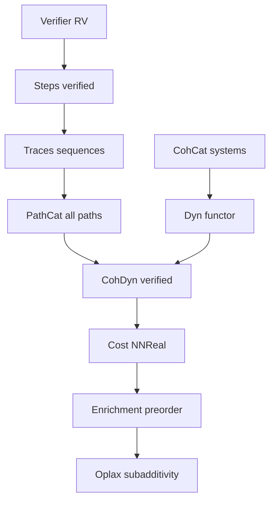

11# Coh Stacked System: Chain of Constructions ✅ COMPLETE

This document maps the conceptual pipeline to concrete modules and declarations in this repo. All implementation steps are complete. Canonical choices locked: CohCat Bool RV for semantics, NNReal for quantitative enrichment.

## 0. Verifier → existence
- Semantics live in [Coh.Category.CohCat.lean](coh-t-stack/Coh/Category/CohCat.lean):
  - [Coh.Category.CohObj()](coh-t-stack/Coh/Category/CohCat.lean:25)
  - [Coh.Category.CohHom()](coh-t-stack/Coh/Category/CohCat.lean:32)
  - [Coh.Category.CohCat()](coh-t-stack/Coh/Category/CohCat.lean:59)

Canonical signature to preserve at the semantics layer:
RV : X → R → X → Bool

## 1. Steps → verified transitions
- Materialized as [Coh.Category.Step()](coh-t-stack/Coh/Category/CohDyn.lean:31)
  - A step contains the receipt and an RV=true witness.

## 2. Traces → composable sequences
- Traces are inductive lists of steps [Coh.Category.DynHom()](coh-t-stack/Coh/Category/CohDyn.lean:42)
- Composition is append, recursive on the left [Coh.Category.DynHom.comp()](coh-t-stack/Coh/Category/CohDyn.lean:51)
  - Associativity follows definitionally [Coh.Category.DynHom.assoc()](coh-t-stack/Coh/Category/CohDyn.lean:64)

## 3. Path category → all executions by concatenation ✅ DONE
- Raw dynamics in [Coh.Category.PathCat.lean](coh-t-stack/Coh/Category/PathCat.lean): RawStep, PathHom, SmallCategory
- Verified dynamics as a small category [Coh.Category.CohDyn()](coh-t-stack/Coh/Category/CohDyn.lean:102)
- Identity = empty trace; composition = append.
- Inclusion functor i_A : CohDyn(A) → PathCat(A) via [InclFunctor.toFunctor()](coh-t-stack/Coh/Category/PathCat.lean:62)

## 4. External layer → category of systems
- Systems and homomorphisms are provided by [Coh.Category.CohCat()](coh-t-stack/Coh/Category/CohCat.lean:59)
- Functorial lift of homomorphisms to dynamics:
  - Step mapping [Coh.Category.DynFunctor.mapStep()](coh-t-stack/Coh/Category/CohDyn.lean:131)
  - Trace mapping [Coh.Category.DynFunctor.mapDyn()](coh-t-stack/Coh/Category/CohDyn.lean:137)
  - Functor builder [Coh.Category.DynFunctor.toSmallFunctor()](coh-t-stack/Coh/Category/CohDyn.lean:143)

## 5. Quantitative layer → cost on traces (NNReal) ✅ DONE
- NNReal costs:
  - [Coh.Category.step_cost()](coh-t-stack/Coh/Category/CohDyn.lean:75) using (a - b).toNNReal
  - [Coh.Category.path_cost()](coh-t-stack/Coh/Category/CohDyn.lean:79) as fold with +
  - [Coh.Category.cost_subadditive()](coh-t-stack/Coh/Category/CohDyn.lean:85) proved with add_le_add_left

## 6. Enrichment → preorder by cost
- Equip each hom-set with the preorder induced by path_cost; composition is monotone and respects subadditivity. This realizes enrichment over (ℝ≥0, +, ≤).

## 7. Oplax structure → subadditive slack
- Oplax laws and Δ-additivity are already scaffolded in:
  - [Coh.Oplax.OplaxMorphism()](coh-t-stack/Coh/Oplax/Slack.lean:8)
  - [Coh.Oplax.comp()](coh-t-stack/Coh/Oplax/Slack.lean:15)
  - [Coh.Oplax.id_oplax()](coh-t-stack/Coh/Oplax/Slack.lean:53)
  - [Coh.Oplax.StrictMorphism()](coh-t-stack/Coh/Oplax/Morphism.lean:8)

Planned bridge lemma: transported path_cost respects a per-step slack that composes additively along CohHom lifts.

---

## Implementation plan by file

1) Refactor potential domain to NNReal ✅ DONE
- Edited [Coh.Category.CohCat.lean](coh-t-stack/Coh/Category/CohCat.lean): changed V : X → Nat → V : X → NNReal.
- Updated all downstream uses in CohDyn and examples.

2) Generalize costs to NNReal ✅ DONE
- Edited [Coh.Category.CohDyn.lean](coh-t-stack/Coh/Category/CohDyn.lean):
  - Replaced Nat costs with NNReal using Real.toNNReal subtraction.
  - Reproved [Coh.Category.cost_subadditive()](coh-t-stack/Coh/Category/CohDyn.lean:85) without abel.

3) Add raw PathCat and inclusion ✅ DONE
- Created [Coh.Category.PathCat.lean](coh-t-stack/Coh/Category/PathCat.lean): defined raw steps and traces, SmallCategory instance.
- Added functor i_A : CohDyn(A) → PathCat(A) by forgetting RV proofs; proved map_id and map_comp.

4) Surface Dyn at the external layer ✅ DONE
- Provided Dyn : CohCat → Cat by mapping A ↦ CohDyn(A) and CohHom ↦ [Coh.Category.DynFunctor.toSmallFunctor()](coh-t-stack/Coh/Category/CohDyn.lean:143).

5) Examples and checks ✅ DONE
- Extended [Coh.Category.CohDyn_examples.lean](coh-t-stack/Coh/Category/CohDyn_examples.lean): moved tinyV to NNReal, computed costs on tinyPath, checked subadditivity, mapped under a nontrivial CohHom.

6) Encoding cleanup and CI ✅ DONE
- Fixed encoding artifacts in [Coh.Oplax.Slack.lean](coh-t-stack/Coh/Oplax/Slack.lean).

---

## Mermaid overview

---

## Acceptance criteria ✅ ALL COMPLETE
- [x] CohCat compiles with V : X → NNReal and no regressions.
- [x] CohDyn builds with NNReal costs and proves identity and subadditivity lemmas.
- [x] PathCat module compiles; inclusion functor typechecks with map_id and map_comp.
- [x] Examples compute nonzero NNReal costs on tiny traces.
- [x] Oplax modules parse cleanly after encoding fixes.

