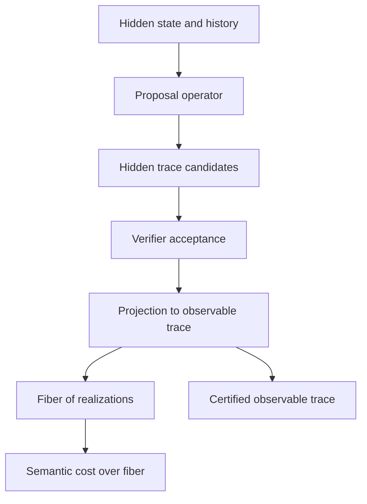

# Full Semantic Layer Plan

## Objective

Complete the paper-aligned semantic layer that is currently only partially represented in [`coh-t-stack/Coh/Category/Measurement.lean`](../coh-t-stack/Coh/Category/Measurement.lean) and [`coh-node/crates/coh-core/src/measurement.rs`](../coh-node/crates/coh-core/src/measurement.rs).

The target is to add first-class support for:

- hidden realizations
- observable projection
- proposal semantics
- verifier-realizable fibers
- semantic cost as a projection-derived quantity
- proofs and runtime checks connecting semantic cost to certified trace composition

## Confirmed Current State

### Already present

- verifier-first admissibility in [`coh-t-stack/Coh/Kernel/Verifier.lean`](../coh-t-stack/Coh/Kernel/Verifier.lean)
- certified trace composition and telescoping in [`coh-t-stack/Coh/Core/Trace.lean`](../coh-t-stack/Coh/Core/Trace.lean)
- internal verified-path category and oplax measurement shell in [`coh-t-stack/Coh/Category/CohDyn.lean`](../coh-t-stack/Coh/Category/CohDyn.lean) and [`coh-t-stack/Coh/Category/Measurement.lean`](../coh-t-stack/Coh/Category/Measurement.lean)
- runtime chain verification in [`coh-node/crates/coh-core/src/verify_micro.rs`](../coh-node/crates/coh-core/src/verify_micro.rs) and [`coh-node/crates/coh-core/src/verify_chain.rs`](../coh-node/crates/coh-core/src/verify_chain.rs)
- reduced dissipation and collapse helpers in [`coh-node/crates/coh-core/src/measurement.rs`](../coh-node/crates/coh-core/src/measurement.rs)
- a semantic search pipeline in [`coh-node/crates/coh-core/src/trajectory/engine.rs`](../coh-node/crates/coh-core/src/trajectory/engine.rs)

### Missing relative to the paper

- explicit hidden-state carrier with fibers over observable states
- explicit proposal operator from hidden state and history to candidate traces
- explicit verifier-realizable hidden traces for an observable trace
- semantic cost defined over hidden realizations rather than over observable bookkeeping alone
- proof/runtime link showing the semantic cost law is induced by projection from hidden traces
- worked examples and tests demonstrating strict separation between syntactic and semantic cost

## Architecture to Add

## Recommended Execution Strategy

Implement in three stacked layers so the proof objects and runtime objects stay aligned.

### Layer 1: Formal semantic kernel in Lean

Add a new semantic kernel in the Lean stack before extending Rust behavior.

#### Deliverables

1. Add a semantic system structure, likely in a new module under [`coh-t-stack/Coh/Core`](../coh-t-stack/Coh/Core), containing:
   - observable state type
   - hidden state type
   - history type
   - projection map
   - proposal operator
   - hidden trace type
   - observable trace projection
   - hidden cost functional
2. Define fiber objects for observable traces.
3. Define verifier-realizable hidden traces as a subtype with acceptance evidence.
4. Define semantic cost as a supremum or max over a finite realization fiber.
5. Prove the semantic subadditivity theorem in Lean.
6. Prove the bridge from hidden-trace concatenation to observable certified-trace composition.

#### Suggested Lean module split

- [`coh-t-stack/Coh/Core/Semantics.lean`](../coh-t-stack/Coh/Core/Semantics.lean)
- [`coh-t-stack/Coh/Core/Projection.lean`](../coh-t-stack/Coh/Core/Projection.lean)
- [`coh-t-stack/Coh/Core/SemanticCost.lean`](../coh-t-stack/Coh/Core/SemanticCost.lean)
- [`coh-t-stack/Coh/Core/SemanticExamples.lean`](../coh-t-stack/Coh/Core/SemanticExamples.lean)

#### Key proof targets

- projection preserves composability
- accepted hidden traces induce accepted observable traces
- fiber finiteness or bounded enumeration hypothesis
- semantic cost well-definedness
- semantic subadditivity under concatenation
- existence of a strict-gap example where semantic cost is less than syntactic cost

### Layer 2: Rust semantic runtime model

Mirror the Lean kernel in Rust using concrete runtime structures.

#### Deliverables

1. Introduce hidden semantic state and history types in a dedicated semantic module under [`coh-node/crates/coh-core/src`](../coh-node/crates/coh-core/src).
2. Add a proposal interface that generates candidate hidden traces from hidden state and history.
3. Add projection functions from hidden traces to observable receipt traces.
4. Add realization-fiber enumeration for bounded cases.
5. Add semantic cost computation over realizations.
6. Add a verifier bridge that rejects hidden realizations whose projections are not certified by the existing kernel.

#### Suggested Rust module split

- [`coh-node/crates/coh-core/src/semantic/mod.rs`](../coh-node/crates/coh-core/src/semantic/mod.rs)
- [`coh-node/crates/coh-core/src/semantic/types.rs`](../coh-node/crates/coh-core/src/semantic/types.rs)
- [`coh-node/crates/coh-core/src/semantic/proposal.rs`](../coh-node/crates/coh-core/src/semantic/proposal.rs)
- [`coh-node/crates/coh-core/src/semantic/projection.rs`](../coh-node/crates/coh-core/src/semantic/projection.rs)
- [`coh-node/crates/coh-core/src/semantic/cost.rs`](../coh-node/crates/coh-core/src/semantic/cost.rs)
- [`coh-node/crates/coh-core/src/semantic/verify.rs`](../coh-node/crates/coh-core/src/semantic/verify.rs)

#### Runtime design notes

- Keep existing [`verify_micro()`](../coh-node/crates/coh-core/src/verify_micro.rs:11) and [`verify_chain()`](../coh-node/crates/coh-core/src/verify_chain.rs:9) as the observable certification kernel.
- Build semantic verification as a layer above the current kernel, not a replacement.
- Use bounded finite fibers first so semantic cost is computable and testable.
- Treat the current measurement code in [`coh-node/crates/coh-core/src/measurement.rs`](../coh-node/crates/coh-core/src/measurement.rs) as a precursor that can be refactored into the new semantic module.

### Layer 3: Cross-layer traceability and examples

#### Deliverables

1. Add one canonical strict-gap example matching the paper.
2. Add one non-gap example where semantic and syntactic cost coincide.
3. Add traceability documentation mapping Lean definitions to Rust types and functions.
4. Add golden vectors for semantic realizations and projected traces.

#### Suggested artifacts

- [`plans/LEAN_RUST_TRACEABILITY_MATRIX.md`](./LEAN_RUST_TRACEABILITY_MATRIX.md) update
- semantic example vectors under [`coh-node`](../coh-node)
- theorem/example alignment notes in [`plans/DOCUMENTATION_AND_SPEC_PLAN.md`](./DOCUMENTATION_AND_SPEC_PLAN.md)

## Concrete Work Breakdown

### Phase 1: Freeze terminology and invariants

- define precise correspondence between paper terms and code terms
- decide whether authority remains part of the semantic accounting law or is factored into an implementation-specific extension
- decide whether semantic cost uses max over finite fibers or a bounded surrogate in runtime code

### Phase 2: Lean semantic core

- create the new Lean modules
- define hidden and observable trace types
- define projection and fiber
- define realizability and semantic cost
- prove compositional lemmas and the semantic subadditivity theorem

### Phase 3: Rust semantic data model

- introduce runtime hidden-trace and history types
- define proposal and projection traits
- implement bounded fiber enumeration
- implement semantic cost aggregation

### Phase 4: Kernel integration

- connect projected traces to existing observable verification
- ensure every accepted semantic realization projects to a chain accepted by [`verify_chain()`](../coh-node/crates/coh-core/src/verify_chain.rs:9)
- surface semantic witnesses alongside existing verification results

### Phase 5: Tests and proofs

- Lean theorem tests for semantic cost laws
- Rust unit tests for projection, fiber construction, and cost aggregation
- cross-language golden cases for strict semantic-cost collapse

### Phase 6: Documentation and migration

- add developer docs for the new semantic interfaces
- document which current measurement helpers are superseded
- update examples to demonstrate proposal to realization to projection to certified trace

## Risks and Design Decisions to Resolve Early

### Decision A: Lean-first or parallel

Best technical path is Lean-first for definitions, then Rust mirroring.

Reason:

- the missing pieces are semantic definitions and laws, not only runtime plumbing
- the current Rust layer already has enough kernel surface to host a semantic module once the formal vocabulary is frozen

### Decision B: Finite fiber assumption

The paper uses a max over realizations. The implementation should explicitly adopt one of:

- finite fiber by construction
- bounded enumerable fiber in runtime plus finite-set theorem hypothesis in Lean

### Decision C: Hidden trace granularity

Need one stable representation for hidden traces so Lean and Rust align. Recommended structure:

- hidden state before
- hidden action payload
- hidden state after
- observable receipt projection
- hidden cost contribution

## Minimal first implementation slice

If the goal is to land the semantic layer incrementally, implement this smallest coherent slice first:

1. Lean definitions for hidden traces, projection, realizable fiber, semantic cost.
2. One Lean theorem for semantic subadditivity on finite fibers.
3. Rust semantic module with bounded enumeration over a toy hidden-state space.
4. One strict-gap example reproduced in both Lean and Rust.

## Success criteria

- semantic realizations are first-class objects, not implicit comments
- semantic cost is computed from hidden realizations, not reused from syntactic spend or defect
- projection fibers are inspectable in code
- Lean proves the semantic cost law for the implemented abstraction
- Rust reproduces the same law on executable examples
- at least one example shows [`semantic_cost`](../coh-node/crates/coh-core/src/semantic/cost.rs) is strictly smaller than syntactic bookkeeping cost

## Recommended implementation order for code mode

1. Lean type and theorem scaffolding
2. Lean semantic example
3. Rust semantic type layer
4. Rust projection and fiber enumeration
5. Rust semantic cost and verifier bridge
6. Tests, vectors, and docs
