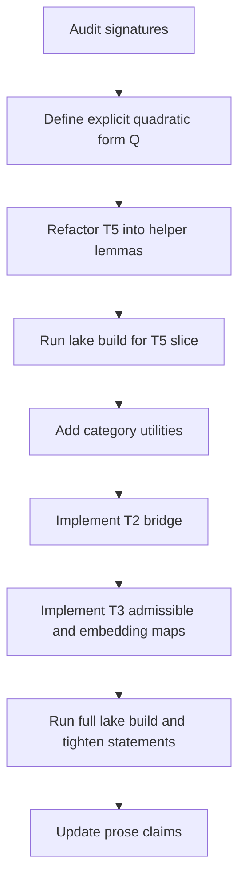

# Opaque Elimination Plan for [`coh-t-stack/Coh`](../coh-t-stack/Coh)

## Goal

Remove all first-party [`opaque`](../coh-t-stack/Coh/Slack/T2_OplaxBridge.lean:8) declarations under [`coh-t-stack/Coh`](../coh-t-stack/Coh) by replacing them with explicit `def`, `structure`, `abbrev`, and theorem bodies that compile under [`lake build`](../coh-t-stack/lakefile.lean).

## Inventory

| Area | Current opaque | File | Replacement direction |
|---|---|---|---|
| T2 | [`T2_Category_to_StrictCoh`](../coh-t-stack/Coh/Slack/T2_OplaxBridge.lean:8) | [`coh-t-stack/Coh/Slack/T2_OplaxBridge.lean`](../coh-t-stack/Coh/Slack/T2_OplaxBridge.lean) | Define an explicit bridge construction or adjust the signature so the bridge exposes the actual strict Coh payload it needs |
| T2 | [`T5_Embedding_is_Functor`](../coh-t-stack/Coh/Slack/T2_OplaxBridge.lean:11) | [`coh-t-stack/Coh/Slack/T2_OplaxBridge.lean`](../coh-t-stack/Coh/Slack/T2_OplaxBridge.lean) | Replace with a concrete functorial transport construction and functor-law proofs |
| T3 | [`Functor_Adm`](../coh-t-stack/Coh/Trace/T3_MacroSlab.lean:9) | [`coh-t-stack/Coh/Trace/T3_MacroSlab.lean`](../coh-t-stack/Coh/Trace/T3_MacroSlab.lean) | Tie explicitly to [`T1_StrictCoh_to_Category`](../coh-t-stack/Coh/Kernel/T1_Category.lean:102) or factor through a new reusable admissible-fragment definition |
| T3 | [`embeddingK`](../coh-t-stack/Coh/Trace/T3_MacroSlab.lean:12) | [`coh-t-stack/Coh/Trace/T3_MacroSlab.lean`](../coh-t-stack/Coh/Trace/T3_MacroSlab.lean) | Define the embedding object-by-object and morphism-by-morphism with preservation lemmas |
| T5 | [`Q`](../coh-t-stack/Coh/Selection/T5_DiracSelection.lean:71) | [`coh-t-stack/Coh/Selection/T5_DiracSelection.lean`](../coh-t-stack/Coh/Selection/T5_DiracSelection.lean) | Give an explicit diagonal quadratic form and prove the helper lemmas the final theorem needs |

## Mathlib and Lean support confirmed

The library research suggests that T5 can lean much more heavily on existing Mathlib than the current file comments imply.

### Clifford algebra API

- [`CliffordAlgebra.lift`](../coh-t-stack/.lake/packages/mathlib/Mathlib/LinearAlgebra/CliffordAlgebra/Basic.lean:129) already packages the universal property needed for algebra maps out of a Clifford algebra.
- [`CliffordAlgebra.lift_ι_apply`](../coh-t-stack/.lake/packages/mathlib/Mathlib/LinearAlgebra/CliffordAlgebra/Basic.lean:159) gives the generator evaluation rule.
- [`CliffordAlgebra.lift_unique`](../coh-t-stack/.lake/packages/mathlib/Mathlib/LinearAlgebra/CliffordAlgebra/Basic.lean:164) provides the uniqueness principle needed for extensional arguments.

### Quadratic form API

- [`QuadraticForm.weightedSumSquares`](../coh-t-stack/.lake/packages/mathlib/Mathlib/LinearAlgebra/QuadraticForm/Basic.lean:1353) gives an explicit off-the-shelf quadratic form on `Fin n → 𝕜`.
- [`QuadraticForm.equivalent_weightedSumSquares`](../coh-t-stack/.lake/packages/mathlib/Mathlib/LinearAlgebra/QuadraticForm/IsometryEquiv.lean:155) can reduce a finite-dimensional quadratic form to weighted sum squares.
- [`QuadraticForm.equivalent_weightedSumSquares_units_of_nondegenerate'`](../coh-t-stack/.lake/packages/mathlib/Mathlib/LinearAlgebra/QuadraticForm/IsometryEquiv.lean:160) upgrades this in the nondegenerate case.
- [`QuadraticForm.equivalent_sum_squares`](../coh-t-stack/.lake/packages/mathlib/Mathlib/LinearAlgebra/QuadraticForm/Complex.lean:71) is especially important: over `ℂ`, every nondegenerate quadratic form is already equivalent to the all-ones sum-of-squares form.

### Finite-dimensional linear algebra API

- [`LinearEquiv.finrank_eq`](../coh-t-stack/.lake/packages/mathlib/Mathlib/LinearAlgebra/Dimension/Finrank.lean:23) is the standard transport lemma for dimensions under equivalence.
- [`LinearEquiv.ofFinrankEq`](../coh-t-stack/.lake/packages/mathlib/Mathlib/LinearAlgebra/Dimension/Free.lean:160) can construct linear equivalences from matching finite ranks when the ambient instances are available.
- [`Module.finrank_fin_fun`](../coh-t-stack/.lake/packages/mathlib/Mathlib/LinearAlgebra/Dimension/Constructions.lean:309) gives the exact dimension of `Fin n → R`.

### Category theory API

- Mathlib already provides [`CategoryTheory.Functor`](../coh-t-stack/.lake/packages/mathlib/Mathlib/CategoryTheory/Functor/Basic.lean:36) with built-in laws [`Functor.map_id`](../coh-t-stack/.lake/packages/mathlib/Mathlib/CategoryTheory/Functor/Basic.lean:39) and [`Functor.map_comp`](../coh-t-stack/.lake/packages/mathlib/Mathlib/CategoryTheory/Functor/Basic.lean:41).
- [`Functor.ext`](../coh-t-stack/.lake/packages/mathlib/Mathlib/CategoryTheory/Functor/Currying.lean:137) exists and is usable for extensional equality proofs between functors.

## Consequences for the implementation strategy

1. T5 should no longer be planned around a custom proof of generic complex quadratic-form classification.
   It should instead try to instantiate [`QuadraticForm.equivalent_sum_squares`](../coh-t-stack/.lake/packages/mathlib/Mathlib/LinearAlgebra/QuadraticForm/Complex.lean:71) for the explicit replacement of [`Q`](../coh-t-stack/Coh/Selection/T5_DiracSelection.lean:71).
2. The current T5 theorem can likely be decomposed into:
   - explicit definition of `Q` as a weighted sum of squares or equivalent diagonal form
   - nondegeneracy lemma for `Q`
   - equivalence-to-sum-squares step via Mathlib
   - Clifford-algebra lift and dimension transport step
3. T2 and T3 still appear to require custom local structures or signature revision, because the obstacle there is not missing library support but insufficient data in the current theorem statements.

## Priority shift: implement T5 first

The execution order is revised so T5 is the first opaque-removal target.

Why this comes first:

- [`Q`](../coh-t-stack/Coh/Selection/T5_DiracSelection.lean:71) is the only first-party [`opaque`](../coh-t-stack/Coh/Selection/T5_DiracSelection.lean:71) whose replacement path is already strongly supported by Mathlib.
- The key APIs are already available: [`QuadraticForm.weightedSumSquares`](../coh-t-stack/.lake/packages/mathlib/Mathlib/LinearAlgebra/QuadraticForm/Basic.lean:1353), [`QuadraticForm.equivalent_sum_squares`](../coh-t-stack/.lake/packages/mathlib/Mathlib/LinearAlgebra/QuadraticForm/Complex.lean:71), [`CliffordAlgebra.lift`](../coh-t-stack/.lake/packages/mathlib/Mathlib/LinearAlgebra/CliffordAlgebra/Basic.lean:129), and [`LinearEquiv.finrank_eq`](../coh-t-stack/.lake/packages/mathlib/Mathlib/LinearAlgebra/Dimension/Finrank.lean:23).
- T2 and T3 remain modeling problems first and proof problems second, because the current bridge signatures do not obviously expose enough structure to define the desired objects honestly.

This means the first implementation milestone should be: remove [`Q`](../coh-t-stack/Coh/Selection/T5_DiracSelection.lean:71), refactor [`T5_Dirac_inevitability`](../coh-t-stack/Coh/Selection/T5_DiracSelection.lean:82) into smaller lemmas, validate with [`lake build`](../coh-t-stack/lakefile.lean), and only then move to the T2/T3 redesign.

## Important design checkpoint

Before implementation, verify whether the current T2 and T3 signatures are already strong enough to support an explicit construction.

- [`StrictCoh`](../coh-t-stack/Coh/Kernel/T1_Category.lean:64) requires receipts, a verifier, soundness, identity admissibility, and closure of admissibility under composition.
- [`SmallCategory`](../coh-t-stack/Coh/Kernel/T1_Category.lean:91) only carries homs, identities, composition, and category laws.

This means at least one of the following will likely be necessary:

1. Strengthen T2 inputs with extra receipt and verifier data.
2. Define a canonical trivial receipt decoration and prove it lawful.
3. Split the current placeholder names into smaller constructions with more honest types.

The plan below assumes theorem signatures may need refinement if the present types are too weak for an explicit proof.

## Execution order

## Concrete implementation plan

### 1. Replace [`Q`](../coh-t-stack/Coh/Selection/T5_DiracSelection.lean:71) with an explicit quadratic form

Target file: [`coh-t-stack/Coh/Selection/T5_DiracSelection.lean`](../coh-t-stack/Coh/Selection/T5_DiracSelection.lean)

Planned work:

- Define `Q` concretely using [`QuadraticForm.weightedSumSquares`](../coh-t-stack/.lake/packages/mathlib/Mathlib/LinearAlgebra/QuadraticForm/Basic.lean:1353) or a simple diagonal form explicitly reducible to it.
- Prefer a form whose nondegeneracy can be discharged directly or packaged as a clean theorem assumption.
- Add helper lemmas for evaluation and simplification so later uses of [`CliffordAlgebra.lift`](../coh-t-stack/.lake/packages/mathlib/Mathlib/LinearAlgebra/CliffordAlgebra/Basic.lean:129) do not rely on ad hoc rewriting.

### 2. Refactor T5 into explicit helper lemmas

Target file: [`coh-t-stack/Coh/Selection/T5_DiracSelection.lean`](../coh-t-stack/Coh/Selection/T5_DiracSelection.lean)

Planned work:

- Replace prose-level sketch steps with named lemmas.
- Use [`QuadraticForm.equivalent_sum_squares`](../coh-t-stack/.lake/packages/mathlib/Mathlib/LinearAlgebra/QuadraticForm/Complex.lean:71) rather than reproving complex quadratic-form classification.
- Use [`CliffordAlgebra.lift_ι_apply`](../coh-t-stack/.lake/packages/mathlib/Mathlib/LinearAlgebra/CliffordAlgebra/Basic.lean:159) and [`CliffordAlgebra.lift_unique`](../coh-t-stack/.lake/packages/mathlib/Mathlib/LinearAlgebra/CliffordAlgebra/Basic.lean:164) for universal-property arguments.
- Keep the first pass conservative: de-opaque the file even if the theorem remains assumption-heavy.

Suggested helper-lemma ladder:

- `Q_explicit_apply`
- `Q_nondegenerate` or `Q_separatingLeft`
- `Q_equiv_sum_squares`
- `clifford_finrank_transfer`
- `alg_equiv_preserves_finrank`
- `dirac_dimension_from_clifford_equiv`

### 3. Validate the T5 slice before category work

After the T5 refactor:

- run [`lake build`](../coh-t-stack/lakefile.lean)
- confirm [`Q`](../coh-t-stack/Coh/Selection/T5_DiracSelection.lean:71) is no longer first-party [`opaque`](../coh-t-stack/Coh/Selection/T5_DiracSelection.lean:71)
- record exactly which T5 assumptions remain mathematically necessary

### 4. Add a reusable categorical utilities layer

Create a new Lean module, likely [`coh-t-stack/Coh/Kernel`](../coh-t-stack/Coh/Kernel.lean)-adjacent, to host small reusable constructions that T2 and T3 both need.

Planned definitions and lemmas:

- `CategoryFunctor` structure for object and morphism maps between [`SmallCategory`](../coh-t-stack/Coh/Kernel/T1_Category.lean:91) instances.
- identity preservation lemma
- composition preservation lemma
- extensionality lemma for functors with equal object and morphism action
- transport lemmas for subtype-based admissible homs
- helper lemmas for packaging subtype equalities with [`Subtype.ext`](../coh-t-stack/Coh/Kernel/T1_Category.lean:107)

### 5. Replace T2 placeholders with explicit bridge constructions

Target file: [`coh-t-stack/Coh/Slack/T2_OplaxBridge.lean`](../coh-t-stack/Coh/Slack/T2_OplaxBridge.lean)

Planned work:

- Decide the true bridge target type.
- If current inputs are insufficient, introduce an auxiliary structure such as `ReceiptDecoratedCategory` or `LawfulCategoryData`.
- Define a canonical verifier and receipt assignment.
- Prove bridge helper lemmas:
  - verifier soundness
  - verifier identity acceptance
  - verifier composition closure
  - identity transport
  - composition transport
  - object-level and hom-level definitional simplification lemmas
- Replace [`T2_Category_to_StrictCoh`](../coh-t-stack/Coh/Slack/T2_OplaxBridge.lean:8) with a real definition or theorem.
- Replace [`T5_Embedding_is_Functor`](../coh-t-stack/Coh/Slack/T2_OplaxBridge.lean:11) with an explicit functor construction plus law proofs.

### 6. Replace T3 placeholders with explicit admissible-fragment and embedding definitions

Target file: [`coh-t-stack/Coh/Trace/T3_MacroSlab.lean`](../coh-t-stack/Coh/Trace/T3_MacroSlab.lean)

Planned work:

- Define [`Functor_Adm`](../coh-t-stack/Coh/Trace/T3_MacroSlab.lean:9) explicitly, ideally by reusing [`T1_StrictCoh_to_Category`](../coh-t-stack/Coh/Kernel/T1_Category.lean:102) instead of duplicating logic.
- Prove helper lemmas showing:
  - object map is identity or the intended embedding map
  - hom map respects admissibility witnesses
  - identity morphisms map to identity morphisms
  - composition maps to composition
  - admissible fragment commutes with the T2 bridge when expected
- Define [`embeddingK`](../coh-t-stack/Coh/Trace/T3_MacroSlab.lean:12) explicitly and prove its embedding laws.

### 7. Validation phase

After each replacement:

- run [`lake build`](../coh-t-stack/lakefile.lean)
- remove unused imports and stale comments
- ensure there are no remaining first-party [`opaque`](../coh-t-stack/Coh/Selection/T5_DiracSelection.lean:71) declarations under [`coh-t-stack/Coh`](../coh-t-stack/Coh)
- re-check that public docs such as [`FORMAL_FOUNDATION.md`](../FORMAL_FOUNDATION.md) only claim what the final theorem statements actually prove

## Implementation checklist

- [ ] Define explicit replacement for [`Q`](../coh-t-stack/Coh/Selection/T5_DiracSelection.lean:71)
- [ ] Split T5 into helper lemmas and a final theorem
- [ ] Validate the T5 slice with [`lake build`](../coh-t-stack/lakefile.lean)
- [ ] Audit T2 and T3 signatures for implementability without hidden extra data
- [ ] Add shared category and functor utilities module
- [ ] Define any auxiliary receipt-decorated categorical structure required by T2
- [ ] Implement explicit replacement for [`T2_Category_to_StrictCoh`](../coh-t-stack/Coh/Slack/T2_OplaxBridge.lean:8)
- [ ] Implement explicit replacement for [`T5_Embedding_is_Functor`](../coh-t-stack/Coh/Slack/T2_OplaxBridge.lean:11)
- [ ] Implement explicit replacement for [`Functor_Adm`](../coh-t-stack/Coh/Trace/T3_MacroSlab.lean:9)
- [ ] Implement explicit replacement for [`embeddingK`](../coh-t-stack/Coh/Trace/T3_MacroSlab.lean:12)
- [ ] Run [`lake build`](../coh-t-stack/lakefile.lean) until the Lean stack is opaque-free
- [ ] Update prose in [`FORMAL_FOUNDATION.md`](../FORMAL_FOUNDATION.md) and related docs if theorem strength changed

## Expected implementation risks

- T2 may require theorem restatement because [`SmallCategory`](../coh-t-stack/Coh/Kernel/T1_Category.lean:91) does not by itself contain enough data to recover a [`StrictCoh`](../coh-t-stack/Coh/Kernel/T1_Category.lean:64).
- T3 may collapse into aliases of existing T1 constructions unless the intended macro-slab semantics are made more explicit.
- T5 may be easiest to de-opaque in two passes:
  - first remove [`Q`](../coh-t-stack/Coh/Selection/T5_DiracSelection.lean:71) while preserving the current theorem strength
  - then strengthen the theorem only after the explicit quadratic form compiles cleanly
