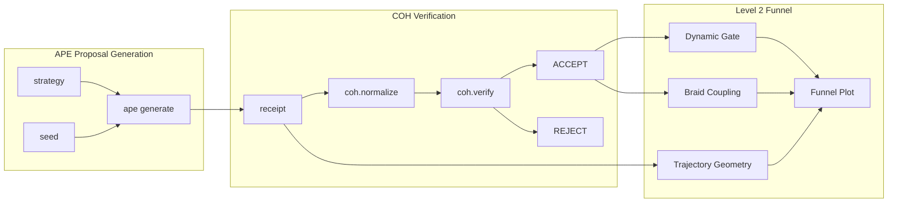

# Level 2 Visualization Integration Plan

## Executive Summary

This document provides a phased migration plan to integrate the Level 2 Python visualization script (`ape_phaseloom_coh_funnel_level2.py`) with the existing Coh-wedge system.

**Current State:** Your script generates synthetic micro-receipts using mathematical models
**Target State:** Real APE proposal generation → COH verification → Level 2 visualizations

---

## Phase 1: Gap Analysis

### What Your Script Does (Current)
| Component | Current Implementation |
|-----------|---------------------|
| Receipt Generation | `make_receipt(strategy, idx, rng)` - synthetic with randomized budgets |
| Trajectory Geometry | Mathematical models in `proposal_trajectory()` based on budget values |
| Verification | Fallback deterministic accounting law when COH unavailable |
| Visualization | Full Level 2 funnel with dynamic aperture, braid coupling |

### What Exists in Coh-wedge (Already Built)
| Component | Implementation |
|-----------|--------------|
| APE Proposals | `Coh-wedge-master/ape/target/release/ape.exe` - Rust binary |
| COH Verifier | Python module `coh` with `verify()`, `normalize()` |
| Integration Script | `ape_integrated_coh_funnel.py` - 694 lines |

### Integration Gap
```
Your Script:  make_receipt() → synthetic_verify() → visualize
                  ↓
Integration: ape generate → COH.verify() → visualize (existing)
                  ↓
Target:      ape generate → COH.verify() → visualize (yours)
```

---

## Phase 2: APE CLI Bridge

### Step 2.1: Locate APE Binary
```python
# From ape_integrated_coh_funnel.py lines 104-113
APE_CLI_PATH = Path("Coh-wedge-master/ape/target/release/ape.exe")
```

### Step 2.2: Replace make_receipt()
Replace your synthetic `make_receipt()` with:

```python
# New function to call APE CLI
def generate_ape_proposal(strategy: str, seed: int) -> Optional[dict]:
    """Generate real proposal using APE Rust CLI."""
    ape_bin = get_ape_binary()
    result = subprocess.run(
        f'"{ape_bin}" generate --strategy {strategy} --seed {seed}',
        capture_output=True, text=True, timeout=5.0, shell=True
    )
    if result.returncode != 0:
        return synthetic_fallback(strategy, seed)  # Your existing logic
    
    return json.loads(result.stdout.strip())
```

### Step 2.3: Strategy Mapping
Map your 6 groups to APE CLI arguments:

| Your Group | APE Strategy |
|-----------|-------------|
| EXPLORE | `mutation` |
| EXPLOIT | `recombination` |
| BRIDGE | `contradiction` |
| PERTURB | `overflow` |
| ADVERSARY | `runtime` |
| REPAIR | `violation` |

---

## Phase 3: COH Verifier Integration

### Step 3.1: Import COH Module
```python
# Try real import, fallback to deterministic
try:
    import coh as COH
    COH_AVAILABLE = True
except ImportError:
    COH_AVAILABLE = False
    # Your existing synthetic_verify() becomes fallback
```

### Step 3.2: Replace verify_receipt()
From `ape_integrated_coh_funnel.py` lines 229-261:

```python
def verify_receipt_coh(receipt: dict) -> tuple[str, Optional[str], str]:
    """Verify receipt with COH or fallback."""
    if not COH_AVAILABLE:
        return synthetic_verify(receipt)
    
    try:
        COH.verify(receipt)
        return ("ACCEPT", None, "verified")
    except COH.CohVerificationError as e:
        return ("REJECT_MARGIN", str(e), "coh.reject")
    except COH.CohMalformedError as e:
        return ("MALFORMED", str(e), "coh.malformed")
```

### Step 3.3: Use coh.normalize()
For chain digest computation:
```python
# After making receipt, compute hash
if COH_AVAILABLE:
    norm = COH.normalize(receipt)
    receipt["chain_digest_next"] = norm.hash
```

---

## Phase 4: Preserve Level 2 Visualization

### What to Keep from Your Script

| Feature | Retention |
|---------|-----------|
| Dynamic aperture | `compute_dynamic_gate_boundary()` - Keep |
| Braid coupling | `braid_coupling()` - Keep |
| Trajectory geometry | `proposal_trajectory()` - Keep (enhance with real budgets) |
| Post-gate shapes | `post_gate_shape()` - Keep |
| Metric thresholds | Keep all `*_MAX` constants |

### Integration Points
```
Real receipt metrics → Your trajectory geometry → Your visualization
     ↓                      ↓                        ↓
  v_pre, v_post,    amp, f1, f2 derived   Full funnel output
  spend, defect    from real budgets
```

---

## Phase 5: Testing & Validation

### Test Checklist

- [ ] APE binary builds and runs
- [ ] CLI generates 520 proposals without timeout
- [ ] COH module imports successfully
- [ ] COH.verify() accepts valid receipts
- [ ] COH.verify() rejects margin failures
- [ ] Dynamic aperture renders correctly
- [ ] Output file saves with proper DPI

---

## Dependency Checklist

### Required Build Steps
```bash
# 1. Build APE
cd Coh-wedge-master && cargo build --release -p ape

# 2. Build COH Python module
cd coh-node && cargo build --release -p coh-python
# Then: pip install target/release/libcoh*.whl

# 3. Python packages
pip install numpy matplotlib
```

### Binary Locations Expected
```
Coh-wedge-master/ape/target/release/ape.exe   # APE generator
coh-node/target/release/libcoh*.pyd         # COH Python module
```

---

## Architecture Diagram



---

## Implementation Priority

1. **Week 1:** Add APE CLI bridge (replace `make_receipt()`)
2. **Week 2:** Add COH verifier integration
3. **Week 3:** Preserve and test Level 2 visualizations
4. **Week 4:** End-to-end validation and benchmarking

---

## Risk Mitigation

| Risk | Mitigation |
|------|-----------|
| APE binary timeout | Your existing synthetic_verify() as automatic fallback |
| COH import failure | Conditional import with deterministic fallback |
| Trajectory mismatch | Map real budget values to geometry parameters |
| Performance | Batch generation, parallel verification |

---

## Files Created

| File | Purpose |
|------|--------|
| `scripts/ape_cli_bridge.py` | APE CLI integration module |
| `scripts/coh_bridge.py` | COH verifier bridge module |
| `scripts/ape_coh_level2_integration.py` | Complete integration wrapper |

## Quick Start

```bash
# Test the integration
python scripts/ape_coh_level2_integration.py

# The script will:
# 1. Try to import APE binary
# 2. Try to import COH module
# 3. Generate proposals through full pipeline
# 4. Compute statistics
```

## Integration Pattern in Your Script

```python
# Add to your existing script:
from ape_cli_bridge import generate_ape_proposal
from coh_bridge import verify_receipt_coh

# Replace make_receipt() with:
receipt = generate_ape_proposal(strategy, seed)
outcome, detail, path = verify_receipt_coh(receipt)

---

## Summary

Your Level 2 script has excellent visualization and trajectory geometry. Integration requires:

1. **Swap** synthetic `make_receipt()` with CLI call to APE binary
2. **Bridge** to real `COH.verify()` function
3. **Preserve** all your visualization enhancements

The existing `ape_integrated_coh_funnel.py` provides the integration patterns you need.