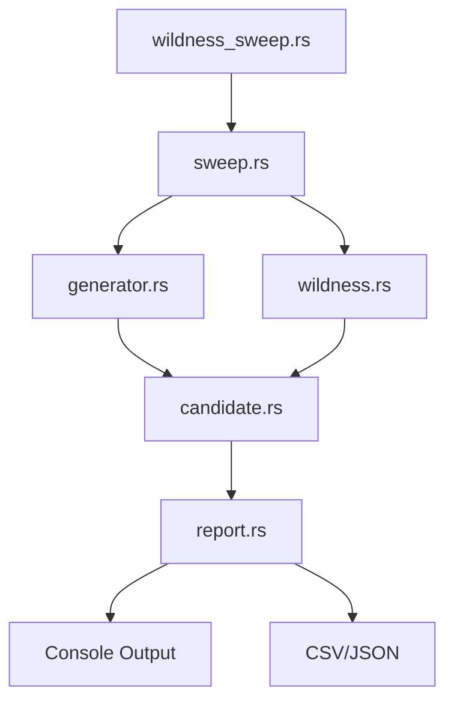

# NPE Wildness Boundary Test — Implementation Plan

## Overview

This plan implements the **Genesis Wildness Sweep** test: a bounded proposal-generation benchmark that measures how much generative diversity the NPE can produce while remaining Genesis-admissible and Coherence-safe.

### Core Question

> How much novelty can the NPE produce before it breaks admissibility?

### Test Objective

Find the optimal wildness level λ* that maximizes wildness yield:

$$Y(\lambda) = A_{\text{Form}}(\lambda) \cdot \mathbb{E}[\text{Novelty} \mid z \in \mathcal{F}]$$

---

## Implementation Location

```
coh-node/crates/coh-genesis/
├── src/
│   ├── lib.rs          (export new modules)
│   ├── candidate.rs    (GenesisCandidate, ProjectedCohClaim)
│   ├── wildness.rs     (WildnessLevel, novelty calculation)
│   ├── generator.rs    (SyntheticNpeGenerator)
│   ├── sweep.rs        (wildness sweep algorithm)
│   └── report.rs      (report generation)
├── examples/
│   └── wildness_sweep.rs    (entry point)
└── tests/
    └── wildness_boundary.rs (unit tests)
```

---

## Data Structures

### GenesisCandidate

```rust
pub struct GenesisCandidate {
    pub id: String,
    pub wildness: f64,

    // Genesis metrics:
    pub m_before: u128,      // M(g): complexity before
    pub m_after: u128,       // M(g'): complexity after
    pub generation_cost: u128, // C(p): generation cost
    pub generation_defect: u128, // D(p): allowed defect budget

    // Novelty score:
    pub novelty: f64,

    // Projected Coherence claim:
    pub projection: ProjectedCohClaim,
}
```

### ProjectedCohClaim

```rust
pub struct ProjectedCohClaim {
    pub v_before: u128,   // V(x): valuation before
    pub v_after: u128,   // V(y): valuation after
    pub spend: u128,     // Spend(R): execution cost
    pub defect: u128,   // Defect(R): allowed defect
    pub rv_accept: bool, // RV result
}
```

### WildnessResult

```rust
pub struct WildnessResult {
    pub wildness: f64,
    pub total: usize,

    // Acceptance rates:
    pub genesis_accept_rate: f64,
    pub coh_accept_rate: f64,
    pub formation_accept_rate: f64,

    // Novelty metrics:
    pub avg_novelty_all: f64,
    pub avg_novelty_accepted: f64,
    pub wildness_yield: f64,

    // Rejection breakdown:
    pub genesis_rejects: usize,
    pub rv_rejects: usize,
    pub coherence_rejects: usize,
}
```

---

## Core Functions

### Genesis Margin

$$\Delta_{\text{Gen}} = M(g) + D(p) - M(g') - C(p)$$

```rust
pub fn genesis_margin(c: &GenesisCandidate) -> i128 {
    (c.m_before as i128 + c.generation_defect as i128)
        - (c.m_after as i128 + c.generation_cost as i128)
}
```

### Genesis Admissibility

```rust
pub fn is_genesis_admissible(c: &GenesisCandidate) -> bool {
    genesis_margin(c) >= 0
}
```

### Coherence Margin

$$\Delta_{\text{Coh}} = V(x) + \text{Defect}(R) - V(y) - \text{Spend}(R)$$

```rust
pub fn coherence_margin(c: &GenesisCandidate) -> i128 {
    let p = &c.projection;
    (p.v_before as i128 + p.defect as i128)
        - (p.v_after as i128 + p.spend as i128)
}
```

### Coherence Admissibility

```rust
pub fn is_coh_admissible(c: &GenesisCandidate) -> bool {
    c.projection.rv_accept && coherence_margin(c) >= 0
}
```

### Formation Admissibility

```rust
pub fn is_formation_admissible(c: &GenesisCandidate) -> bool {
    is_genesis_admissible(c) && is_coh_admissible(c)
}
```

---

## Generator Behavior

The `SyntheticNpeGenerator` produces candidates where higher wildness (λ) causes:

| λ   | Effect |
|-----|--------|
| 0.0 | Minimal variation, high acceptance, low novelty |
| 0.5 | Low variation, good acceptance, moderate novelty |
| 1.0 | Normal variation, balanced acceptance/novelty |
| 2.0 | Aggressive recombination, moderate acceptance, high novelty |
| 5.0 | Unconventional proposals, low acceptance, very high novelty |
| 10.0 | Near-chaotic proposals, almost total rejection |

### Generation Algorithm

For each candidate at wildness λ:

1. **Generate base metrics** with controlled randomness
2. **Increase M(g')** exponentially with λ (more complex output)
3. **Increase C(p)** linearly with λ (more generation cost)
4. **Increase novelty** as function of distance from baseline
5. **Simulate RV accept** with probability decreasing in λ
6. **Set projected metrics** with correlated costs

---

## Sweep Algorithm

```rust
pub fn run_wildness_sweep(
    levels: &[f64],
    count: usize,
    seed: u64,
) -> Vec<WildnessResult> {
    let generator = SyntheticNpeGenerator::new(seed);

    levels
        .iter()
        .map(|&lambda| {
            let candidates = generator.generate(lambda, count);

            let mut genesis_accepts = 0;
            let mut coh_accepts = 0;
            let mut formation_accepts = 0;
            let mut novelty_sum_all = 0.0;
            let mut novelty_sum_accepted = 0.0;

            let mut genesis_rejects = 0;
            let mut rv_rejects = 0;
            let mut coherence_rejects = 0;

            for c in &candidates {
                let genesis_ok = is_genesis_admissible(c);
                let coh_ok = is_coh_admissible(c);
                let formation_ok = genesis_ok && coh_ok;

                novelty_sum_all += c.novelty;

                if genesis_ok { genesis_accepts += 1; }
                else { genesis_rejects += 1; }

                if !c.projection.rv_accept { rv_rejects += 1; }

                if genesis_ok && coh_ok { coh_accepts += 1; }
                else if genesis_ok { coherence_rejects += 1; }

                if formation_ok {
                    formation_accepts += 1;
                    novelty_sum_accepted += c.novelty;
                }
            }

            let total = count as f64;
            let avg_novelty_accepted = if formation_accepts > 0 {
                novelty_sum_accepted / formation_accepts as f64
            } else { 0.0 };

            let formation_rate = formation_accepts as f64 / total;
            let yield_ = formation_rate * avg_novelty_accepted;

            WildnessResult {
                wildness: lambda,
                total,

                genesis_accept_rate: genesis_accepts as f64 / total,
                coh_accept_rate: coh_accepts as f64 / total,
                formation_accept_rate: formation_rate,

                avg_novelty_all: novelty_sum_all / total,
                avg_novelty_accepted,
                wildness_yield: yield_,

                genesis_rejects,
                rv_rejects,
                coherence_rejects,
            }
        })
        .collect()
}
```

---

## Report Output

### Console Table

```text
λ       GenAccept  CohAccept  FormAccept  Novelty   Yield   TopReject
0.0     0.98      0.95      0.94        0.8      0.75    -
1.0     0.86      0.78      0.67        3.2     2.14    CohViolation
2.0     0.62      0.58      0.41        7.8     3.21    GenesisViolation
5.0     0.21      0.18      0.07        15.2    1.06    GenesisViolation
10.0    0.03      0.02      0.00        31.0    0.00    RVReject
```

### Files

- `wildness_sweep.csv`: Raw results for analysis
- `wildness_sweep.json`: Structured results for tooling

---

## Expected Boundary Behavior

The test validates three key properties:

1. **Acceptance drops at high wildness**: A_Form(10) ≈ 0 while A_Form(0) ≈ 1
2. **Novelty increases monotonically**: AvgNovelty(λ) increases with λ
3. **Yield peaks at optimal λ**: Y(λ) has a maximum at λ* ∈ [1, 3]

### Success Criteria

- [ ] λ=0 produces >90% Formation acceptance
- [ ] λ=10 produces <5% Formation acceptance
- [ ] λ=2 produces highest yield (optimal balance)
- [ ] Novelty correlates positively with λ
- [ ] Rejection modes correctly attributed (Genesis vs RV vs Coh)

---

## Dependency Flow



---

## First Milestone Targets

1. Run `cargo run -p coh-genesis --example wildness_sweep` successfully
2. Output matches expected table structure
3. Boundary behavior verified (acceptance drops at high λ)
4. Generate report files